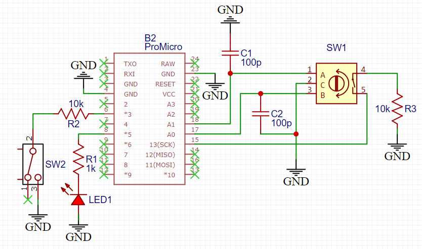
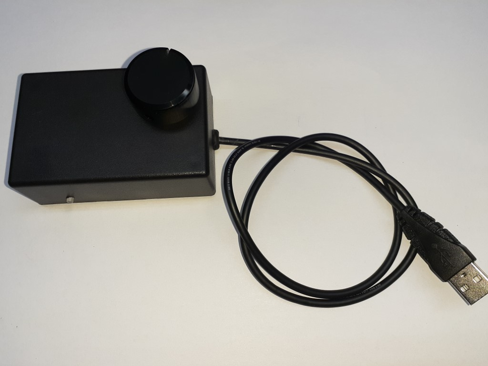

# PC Sound Control

This project uses an Sparkfun ProMicro development board (Atmel 32u4 microprocessor) and a rotary encoder to create an external volume control for a PC. The objective is to make it easy to control the volume and mute during video calls.

The circuit schematic is shown below.

Many rotary encoders are available, the key is to get one which has a built in switch which is activated when the knob is pressed, this is used for muting. Details of the one I used are in the docs directory.

The finished device.

The code in repository has the configuration files to allow it to be imported into the PlatformIO development environment, alternatively it may be edited in the Arduino IDE.
